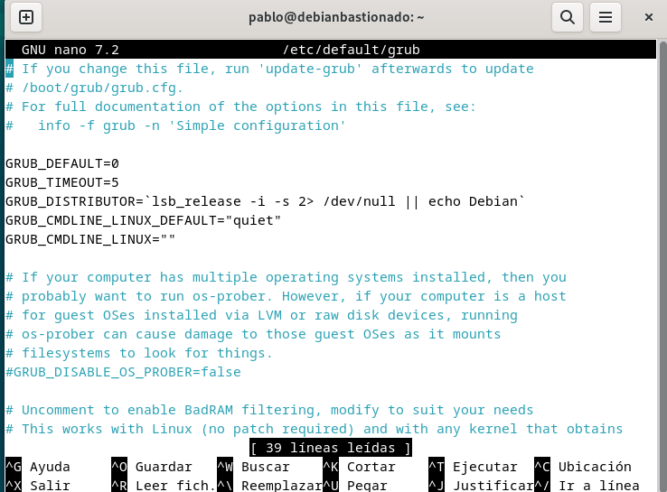
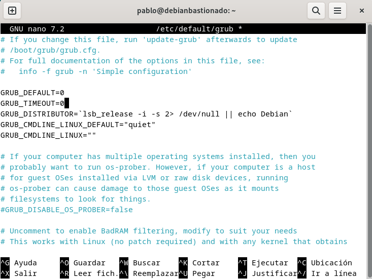
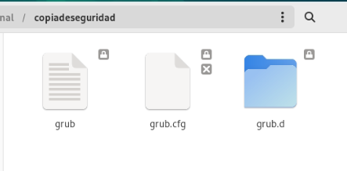
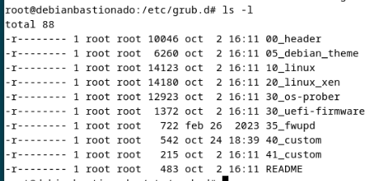

author: Pablo Painceiras Martinez
summary: En este codelab quedan expuestos diferentes mecanismos de protección de BIOS/UEFI.
id: GRUB
categories: codelab,markdown,BIOS,cybersecurity
environments: Web
status: Published
feedback link:
analytics account: ID de Google Analytics
# Proyecto 1.2 Bastionado

## Introducción
Duration 0:02:00

En este proyecto vamos a describir como hacer una configuración segura del GRUB en una maquina virtual Debian 12 alojada en VMWare.

### ¿Que es GRUB?

GRUB (GRand Unified Bootloader) es un gestor de arranque utilizado principalmente por sistemas operativos basados en Linux. Es el software que se ejecuta justo después de que la computadora se enciende y antes de que el sistema operativo se inicie. GRUB permite al usuario elegir entre diferentes sistemas operativos instalados en la misma máquina, así como diferentes versiones de un mismo sistema operativo.

A continuación se explicara como podemos hacer una configuración del GRUB para un arranque seguro.

En este caso estamos en un Debian 12 desktop.

Lo primero abrimos la terminal del sistema.

Luego introducimos el comando “su -” , para tener permisos de administrador 

## Ocultación Menu
Duration 0:08:00
Lo primero que vamos a hacer es ocultar el menú de GRUB 2

Para ello abrimos el fichero “/grub” con el comando “nano /etc/default/grub”, a continuación

cambiamos “GRUB_TIMEOUT=5” a “GRUB_TIMEOUT=0”

Una vez realizado, guardamos el archivo y salimos del editor de texto. 

Una vez fuera, realizamos un “update-grub” para actualizarlo

## Protección de arranque con contraseña
Duration 0:10:00

Pasamos a proteger el arranque con contraseña.

Ejecutamos el siguiente comando “nano /etc/grub.d/40_custom”

Luego escribimos “ set superusers=”*usuario*” “ para asignar un super usuario y justo debajo escribimos “password *usuario contraseña”* con ello le asignaremos una contraseña al super usuario

A continuación actualizamos el fichero

En el caso de que queramos cifrar la contraseña usaremos el siguiente comando:

“grub-mkpasswd-pbkdf2” . Este nos pedira la contraseña para poder cifrarla, a continucación te mostrara en pantalla como es la contraseña cifrada, la cual tendremos que poner en el archivo 40_custom anteriormente visto.

Para ello sustituiremos la password anterior por “password_pbkdf2 *usuario contraseñacifrada*”

Guardaríamos los cambios y haremos de nuevo un update

## Copia de seguridad
Duration 0:04:00

A continuación crearemos una copia de seguridad del arranque.

La haremos de los archivos: 

- /etc/default/grub que es donde se encuentra la configuración de usuario y entorno de GRUB2

- /etc/grub.d Que se usa para añadir elementos personalizados al menú de arranque

- /etc/grub.cfg que es donde se encuentra la configuración de opciones de menú de GRUB2

## Permisos sobre el arranque
Duration 0:05:00

A continuación veremos como cambiaremos los permisos al fichero “/etc/grub.d” para que solo pueda leerlos el usuario *root* 

Para ello vamos a situarnos en el directorio /etc/grub.d

Luego escribimos el comando “chmod 400 *” el cual cambia los permisos de todos los archivos del directorio a lectura única para el usuario *root*

Antes:

Después del chmod:

## Para Terminar
Duration 0:02:00
Por último reiniciaremos el sistema. 

Nos aparecerá la siguiente pantalla en donde tenemos que introducir el super usuario y la contraseña anteriormente cifrada

